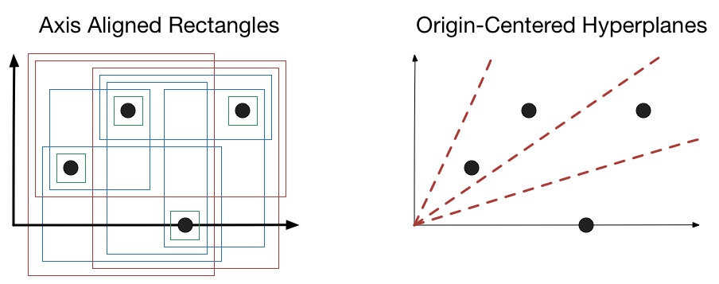

Learnability
=

Due: 2. Oct (40 Points)

Overview
--------

For this homework, we will not be building anything practical.  Instead, we will
implement algorithms that demonstrate and measure the importance of having
hypothesis classes that aren't too powerful.

*Rademacher*: You'll experimentally verify Rademacher results for various classes of hypotheses.  This requires two steps: generating hypotheses and evaluating their correlation with random labels.  The first step is the hardest.  You'll need to take in a dataset as input and then generate all of the possible hypotheses for that dataset (within a specified hypothesis class).  Then, you'll implement code that explicitly computes the Rademacher correlation given those hypotheses.

The two hypothesis classes you'll look at are hyperplanes that pass through the origin and axis aligned rectangles.  You'll want to generate, given a set of points, all of the hypotheses that generate *distinct* classifications of the data.  

In the image above we show the distinct hypotheses for the same set of four points in 2D space (this is the last set of tests in the unit tests).  There are fourteen hypotheses for axis aligned rectangles but only six for the planes (each line can set the positive class to be to the left or to the right).  You'll need to generate all of the possible hypotheses.

*VC Dimension of a SIN Classifier*: This requires some thought but should be very simple to implement.  Given a training set of integers, you'll need to perfectly classify the training set with a single parameter sin classifier.

Implementation
-

Complete the following functions:
* rademacher: Classify.correlation
* rademacher: origin\_plane\_hypotheses
* rademacher: axis\_aligned\_hypotheses
* rademacher: rademacher\_estimate
* vc\_sin: train\_sin\_classifier

What you can assume
------

You can assume any inequality in the books appendicies or anything we *proved*
in class.  If you have doubts, ask on Piazza.

Analysis
-

In your discussion file:
* argue about an ordering of hypothesis classes in terms of complexity:
  hyperplanes through the origin, arbitrary hyperplanes, and axis-aligned
  rectangles (you can use your experiments as a guide, but simply reporting
  those numbers is not sufficient; you must make a mathematical argument)
* prove that your frequency correctly classifies any training set (up to
  floating point precision on the computer).

What to turn in
------

Turn in your completed python files
* rademacher.py
* vc_sin.py

As well as a discussion file
* discussion.pdf

Extra Credit
-

You can get extra credit for implementing a function that returns all possible hyperplanes (not just those that pass through the origin) that divide a dataset.

Hints
------
1.  Feel free to use _bst.py_ for finding points in a range
1.  You may want to use trigonometric functions for the hyperplane function
1.  Do not make your code too slow; you will not get full credits if your code
    does not complete in reasonable time
